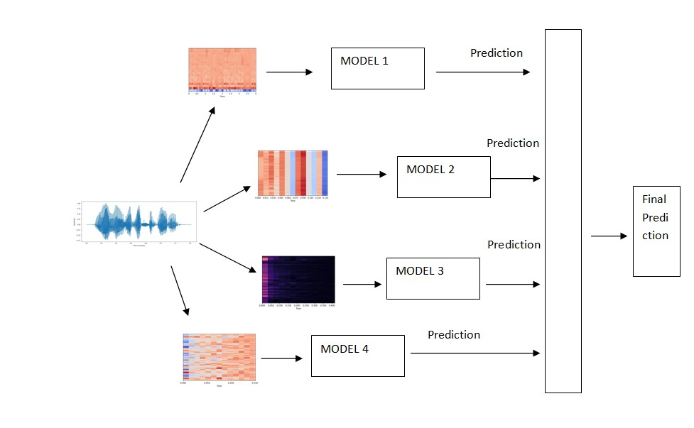
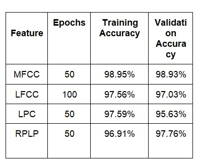

# Speaker Identification For Bengali Speakers Using Deep Neural Networks.

 ## Abstract: 
 The easiest way for two persons to communicate is through speech. Using feature extraction techniques to extract unique features then combining with various models is the way one can identify speakers through machine learning. Many researchers have proposed their way of thinking through implementing different techniques which includes the combination of feature extraction techniques and classification models.
We proposed a novel approach which can be used to uniquely identify a speaker through their voice sample. So, our speaker recognition system uses Deep Neural Networks as classifiers and MFCC, LFCC, LPC, Rasta-PLP as feature extraction techniques. The used dataset is a custom dataset consisting of 10 different speakers, speaking Bengali or English mixed with Bengali language and recorded in a natural environment. Our proposed method achieved 98% accuracy, which is better from previous works.

## Dataset:
* Dataset is created using voice samples of 10 different speakers.
* Each Speaker speaks either in Bengali or a mixture of Bengali and English.
* There are 750 audio samples for each speakers .
* Each audio sample lenght is 4 seconds.
* All speaker aged between 18-60.
* Gender ratio is 1:1.

## Extracted Features:
* MFCC
  
* LFCC
  
* LPC
  
* RPLP
     
  
## Final Model :

## Results of Different CNN Models:

